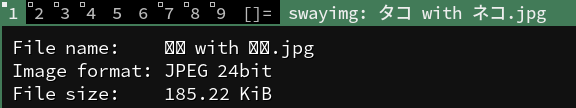
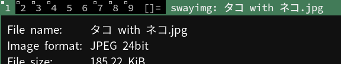
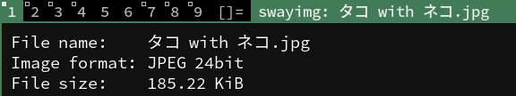

# fork of [Swayimg](https://github.com/artemsen/swayimg): image viewer for Wayland

Fully customizable and lightweight image viewer for Wayland based display servers.

# CJK fonts fix

CJK characters are rendered as "tofu" blocks:

```conf
[font]
name = SourceCodePro
```



---

Although sepcifying the CJK fonts in `swayimgrc` can fix this, but the font for
ASCII/Latin characters would be changed as a side effect:

```conf
[font]
name = Noto Sans CJK JP
```



---

This fork add the fallback fonts support, so the default font family is
respected and CJK characters are rendered correctly:

```conf
[font]
name = SourceCodePro
```




## Build

The project uses Meson build system:
```
meson setup _build_dir
meson compile -C _build_dir
meson install -C _build_dir
```
